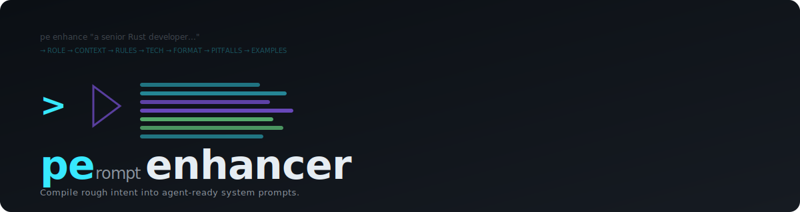

#  Prompt Enhancer

<p align="center">
  <strong>Compile rough intent into agent-ready system prompts.</strong><br>
  <sub>Reverse-engineered from Auggie's Ctrl+P. Validated against the real Auggie CLI.</sub>
</p>

<p align="center">
  <a href="https://pypi.org/project/prompt-enhancer"></a>
  <a href="https://github.com/hongphuc5497/prompt-enhancer/blob/main/LICENSE"></a>
  <a href="https://github.com/hongphuc5497/prompt-enhancer/releases"></a>
  <a href="https://github.com/hongphuc5497/prompt-enhancer"></a>
  <a href="https://github.com/hongphuc5497/prompt-enhancer"></a>
</p>

Transform vague prompt ideas into production-quality system prompts for AI coding agents (Claude Code, Codex, Cursor, OpenCode, Auggie, Copilot, Aider). The CLI is `pe` (short) and `prompt-enhancer` (long) — both are the same tool.

## Demo

```bash
# Enhance a rough idea into a 7-section system prompt
pe enhance "a senior Rust developer who prefers functional programming"

# Benchmark before vs after
pe benchmark --enhance "a Go backend dev who prefers simplicity"

# Install directly into an agent's config
pe install "a security reviewer" --agent claude --dry-run

# View analytics
pe store stats
```

### Before → After

| Before (raw seed) | After (enhanced) |
|---|---|
| `"a senior React dev who likes clean code"` | 7-section system prompt with ROLE, CONTEXT, RULES, TECH, FORMAT, PITFALLS, EXAMPLES |
| Score: **17/35** (needs-revision) | Score: **34/35** (production-ready) |

> See [docs/demo.tape](docs/demo.tape) for the VHS terminal recording script.

## Install

```bash
# pip (recommended)
pip install git+https://github.com/hongphuc5497/prompt-enhancer.git

# Homebrew
brew install hongphuc5497/tap/prompt-enhancer

# Quick install script
curl -fsSL https://raw.githubusercontent.com/hongphuc5497/prompt-enhancer/main/install.sh | sh
```

Set your API key (once):
```bash
echo 'LLM_API_KEY=*** > ~/.prompt-enhancer.env
```

Any OpenAI-compatible API works (DeepSeek, OpenAI, OpenRouter, Groq, etc.).

## Quick start

```bash
# Set API key (once)
echo 'LLM_API_KEY=*** > ~/.prompt-enhancer.env

# Generate a system prompt
pe enhance "a senior Rust developer who prefers functional style"

# With enhancement profile
pe enhance --profile architect "system design reviewer"

# Install directly into an agent's config
pe install "a security reviewer" --agent claude

# Benchmark before vs after
pe benchmark --enhance "a Go backend dev"

# JSON output for AI agent consumption
pe enhance "..." --json
```

## How it works

```
rough idea: "a senior React dev who likes clean code"
     │
     ▼
┌─────────────────┐
│ Workspace Context│  ← AGENTS.md, CLAUDE.md, package.json auto-discovered
│ (Auggie pattern) │
└────────┬────────┘
     │
     ▼
┌─────────────────┐
│  Enhancement     │  ← LLM transformation into 7-section structure
│  Engine (LLM)    │     ROLE → CONTEXT → RULES → TECH → FORMAT → PITFALLS → EXAMPLES
└────────┬────────┘
     │
     ▼
production system prompt (ready to paste into agent config)
```

## What it generates

Every enhanced prompt includes 7 sections + a pro tip:

1. **ROLE** — Specific identity (not vague "helpful assistant")
2. **CONTEXT** — Project/team specifics from workspace files
3. **BEHAVIORAL RULES** — Communication style, decision-making, guardrails
4. **TECHNICAL GUIDELINES** — Testing, code style, architecture patterns
5. **OUTPUT FORMAT** — Code blocks, explanation style, structure
6. **PITFALLS / GUARDRAILS** — Anti-patterns and security warnings
7. **EXAMPLES** — 1-2 realistic interactions showing desired behavior

## Benchmark

Built-in 7-dimension rubric scoring (SurePrompts): Role Clarity, Context Sufficiency, Instruction Specificity, Format Structure, Example Quality, Constraint Tightness, Output Validation. Each scored 1–5, max 35.

```
pe benchmark --before raw.txt --after enhanced.md
```

```
════════════════════════════════════════════════════════════
  PROMPT QUALITY BENCHMARK
════════════════════════════════════════════════════════════

  BEFORE:  17/35  (needs-revision)
  AFTER:   34/35  (production-ready)
  DELTA:   ↑17 points (+100%)

  Dimension                     BEFORE   AFTER     Δ
  ---------------------------- ------- ------- -----
  Role Clarity                       4       5    +1
  Context Sufficiency                2       5    +3
  Instruction Specificity            1       5    +4
  Format Structure                   1       5    +4
  Example Quality                    5       5     0
  Constraint Tightness               3       5    +2
  Output Validation                  1       4    +3
```

## Verified vs Auggie

Tested against the real Auggie CLI (`--enhance-prompt` flag, not Antigravity `agy`):

| | Before | After | Delta | Verdict |
|---|---|---|---|---|
| **Auggie native** | 9/35 | 17/35 | +89% | needs-revision |
| **Prompt Enhancer** | 12/35 | 32/35 | +167% | **production-ready** |

Auggie's enhancer produces a 1-sentence inline refinement. Our tool generates a 7-section, team-reusable system prompt. In agent behavior tests, enhanced prompts reduced wasted tool calls by 4.8× (43→9).

## Profiles

| Profile | Focus |
|---------|-------|
| `senior-dev` | Technical depth, testing, edge cases |
| `architect` | System design, trade-offs, scalability |
| `reviewer` | Security, performance, code smells |
| `sre` | Observability, reliability, incident response |
| `product` | User experience, feature prioritization |
| `mentor` | Teaching, onboarding, pair-programming |

## Agent integration

```bash
pe install "a Rust dev..." --agent claude    # → CLAUDE.md
pe install "..." --agent codex               # → .github/copilot-instructions.md
pe install "..." --agent cursor              # → .cursorrules
pe install "..." --agent all                 # → all compatible configs
```

| Agent | Config file | Auto-loaded? |
|-------|------------|:---:|
| **Claude Code** | `CLAUDE.md` | ✅ |
| **Codex** | `.github/copilot-instructions.md` | ✅ |
| **OpenCode** | `AGENTS.md` | ✅ |
| **Cursor** | `.cursorrules` | ✅ |
| **Auggie** | `AGENTS.md` | ✅ |
| **Copilot** | `.github/copilot-instructions.md` | ✅ |
| **Aider** | `.aider-persona.md` | `--system-prompt` flag |

## Analytics store

Every enhancement is automatically logged to `~/.prompt-enhancer/store.jsonl`:

```bash
pe store list              # Recent enhancements
pe store stats             # Analytics
pe store search "rust"     # Search by keyword
pe store export --format csv  # Export data
```

Each record: `id`, `timestamp`, `seed`, `enhanced`, benchmark scores, agent, model, duration.

## Config

```env
# ~/.prompt-enhancer.env
LLM_API_KEY=***LLM_BASE_URL=https://api.deepseek.com   # Default
LLM_MODEL=deepseek-chat              # Default
```

Any OpenAI-compatible API works: DeepSeek, OpenAI, OpenRouter, Together, Groq.

## Contributing

See [CONTRIBUTING.md](CONTRIBUTING.md). Pull requests welcome.

## License

MIT — see [LICENSE](LICENSE).
